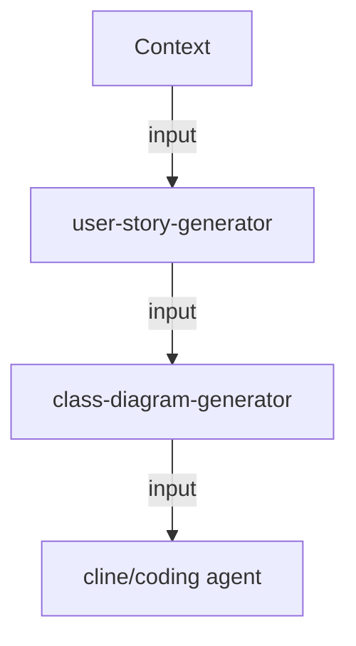

# Prompt Library

## Coding
### Workflow

### References
- https://github.com/seanrioux/user-story-examples/blob/master/readme.md
- https://medium.com/@nik.krichko/prompt-template-for-creating-user-story-ed687b58d53f
- https://docs.cline.bot/improving-your-prompting-skills/custom-instructions-library/cline-memory-bank